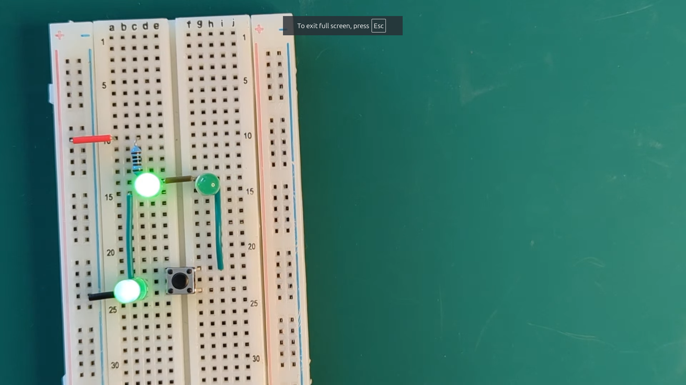

# Practical Diodes and NP Junctions

This video describes the theory of NP junctions, which are the key components of both diodes and bipolar transistors.
Watch this first:

The video contains a few demos that you may want to build by yourself. The lists of components for each mini-project are below:

## Current limiting resistors

Besides this experiment, there's a simple one connecting a coin cell battery (any cell battery you have will work; the CR2032 is a widely available model) and an LED. I'm not providing instructions for that one, you need to just put the components together with the correct polarity.

### What materials you'll need

You will need a powered breadboard (a power supply with 3.3V or 5V will work perfectly. You can use a 9V battery with some special care described below). You will also need

* 5 × identical diodes. My demo uses 1N4148, but you can use other kind. Readily available options are 1N4001 to 1N4007. You could even use LEDs (use the same kind of LED)
* 5 × different resistors. All of them should be at least 220Ω (use 470Ω if you use a 9V battery). In my demo, I used the following values:
  * 220Ω
  * 1KΩ
  * 2KΩ
  * 5.1KΩ
  * 10KΩ
* A multimeter

### Breadboard Layout

### Some experiments to run

1. Measure the voltage drops on the table and see if you get similar values to what I did.
2. Plot an XY chart where you put voltage on the X axis and current on Y. What shape do you get?
3. If you have a power supply with different voltages, try taking the measurements with a different supply voltage. Does the drop over the diodes change a lot?
4. If you have another five diodes of a different kind, try them (you can use LEDs!). What is the average voltage drop for each kind of diode?

## Current steering

### What materials you'll need

- 3 × LEDs (3mm or 5mm ones will work) of the same colour
- 1 × push button
- 1 × resistor. I used 1KΩ, but you can use somewhat lower or higher values, which will still work, affecting only the LED brightness. You can use the technique described in the video to ensure the current across your LEDs doesn't exceed 25mA.

### Breadboard Layout

